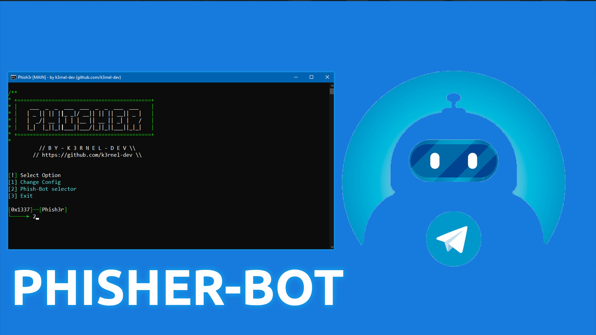
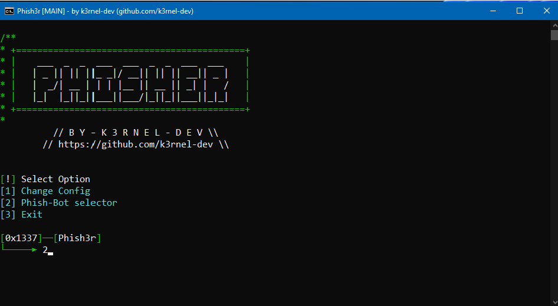
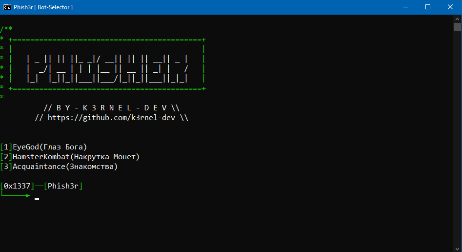

# PhisherBot



## 📑 About
```
❕ EN:
Bot for obtaining a number through a telegram bot using a set of social engineering techniques

❕ RU:
Скрипт позволяющий получить номер целевого пользователя при помощи совокупности техник соц.инженерии.
Есть возможность дописать своих собственных ботов нацеленные на определенные тематики. 
```

## 💻 Screens
<p float="left">
  
  
</p> 

## 🏴‍☠️ Requirements
 * For use this you need a enter this commands(using venv is mandatory):
 ```shell
 python -m venv venv
 
 source venv/bin/activate # <-- if linux
 venv\\bin\\activate # <-- if windows
 
 pip install -r requirements.txt # <-- install requirements
 
 python bot.py # <-- starting bot panel.
 ```

## ⚠️ Disclaimer
```
EN:
This open-source project is provided for educational purposes only!

RU:
Проект исключительно в образовательных целях!
```